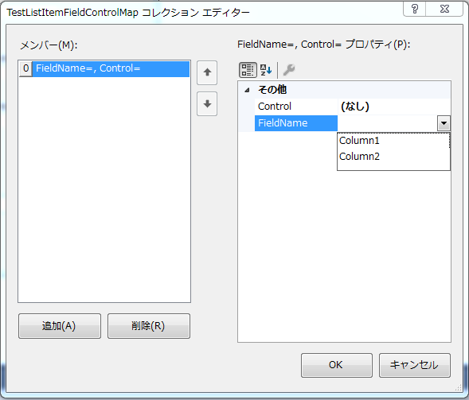

[](https://www.nuget.org/packages/VanishFlare/)

[English](README.md "English")

# VanishFlare #
WinFormsをスピーディに開発するライブラリ。  
[Metroit.Windows.Forms](https://github.com/takiru/Metroit) を拡張しています。  
ターゲットフレームワークは.NET 4.5です。

## 他のコントロールに値を流す ##
FieldControlMaps プロパティを使って、Metroit拡張のCustomAutoCompleteBoxによって選択されたオブジェクトから、値を他のコントロールへ設定することができます。

- VfMapTextBox
- VfMapLimitedTextBox
- VfMapNumericTextBox

プロパティ  

|名前                |意味                                                    |
|--------------------|--------------------------------------------------------|
|FieldControlMaps    |StringFieldControlMap[]                                 |

StringFieldMap
  - Control
    - FieldName の値を設定したいコントロール。
  - FieldName
    - CustomAutoCompleteBoxによって選択されたオブジェクトの設定したい値のプロパティ名。

## 使い方 ##
下記の例では、vfMapTextBox1に入力候補から値を選択した時、Column2の値をlabel1のTextとして設定します。
```C#
vfMapTextBox1.FieldControlMaps = new StringFieldControlMap[] {
    new StringFieldControlMap() { Control = label1, FieldName = "Column2" }
};

var dt = new DataTable();
dt.Columns.Add("Column1");
dt.Columns.Add("Column2");

var row = dt.NewRow();
row["Column1"] = "aaa1 disp";
row["Column2"] = DateTime.Now;
dt.Rows.Add(row);

row = dt.NewRow();
row["Column1"] = "aaa2 disp";
row["Column2"] = new DateTime(2010, 10, 12);
dt.Rows.Add(row);

vfMapTextBox1.CustomAutoCompleteBox.DataSource = dt;
```

下記の例では、vfMapTextBox1に入力候補から値を選択した時、EfSample2クラス内のSample2Dataの値を、label1のTextとして設定します。  
"->"を使うことで、オブジェクト階層の内部へアクセスできます。
```C#
public class EfSample1 : DbContext
{
    [Key]
    public string Sample1Data { get; set; }
    public DbSet<EfSample2> EfSample2 { get; set; }
}

public class EfSample2 : DbContext
{
    [Key]
    public string Sample2Data { get; set; }
}
```
```C#
vfMapTextBox1.FieldControlMaps = new StringFieldControlMap[] {
    new StringFieldControlMap() { Control = label1, FieldName = "EfSample2->Sample2Data" }
};

var efList = new List<EfSample1>();
var efSample1 = new EfSample1()
{
    Sample1Data = "Sample1Data"
};
efSample1.EfSample2.Add(new EfSample2()
{
    Sample2Data = "Sample2Data"
});
efList.Add(efSample1);

vfMapTextBox1.CustomAutoCompleteBox.DataSource = efList;
```

マップするコントロールがCheckBoxの場合、下記基準でCheckedプロパティが設定されます。  

| 値                | 設定値 |
|-------------------|--------|
| "true"            | true   |
| "false"           | false  |
| "0"               | false  |
| "false", "0"以外  | true   |
| 0                 | false  |
| 0以外             | true   |

マップするコントロールがRadioButtonの場合、下記基準でCheckedプロパティが設定されます。  

| 値                | 設定値 |
|-------------------|--------|
| "true"            | true   |
| "false"           | false  |
| "0"               | false  |
| "false", "0"以外  | true   |
| 0                 | false  |
| 0以外             | true   |

マップするコントロールがComboBoxの場合、下記基準でTextプロパティ、SelectedItemプロパティが設定されます。  

| 条件               | 設定プロパティ |
|--------------------|----------------|
| DataSource == null | Text           |
| DataSource != null | SelectedItem   |

## デザイナで、 FieldName をクラスのプロパティから選択する ##
下記のクラスを継承することで、任意のクラスのプロパティを選択する方法が実現できます。  
プロパティは BindingFlags.Public | BindingFlags.Instance | BindingFlags.GetProperty に合致する必要があります。
 - VfTextBoxBase
 - VfLimitedTextBoxBase
 - VfLNumericTextBoxBase

1. 対象となるクラスを用意します。
    ```C#
    public class TestListItem
    {
        public string Column1 { get; set; }
        public DateTime Column2 { get; set; }
    }
    ```
1. プロパティをマッピングするためのクラスを用意します。
    ```C#
    public sealed class TestListItemFieldControlMap : Vf.Windows.Forms.FieldControlMapBase<TestListItem> { }
    ```
1. マッピングクラスを利用するコントロールを用意します。
    ```C#
    public class TestListItemTextBox : VfTextBoxBase<TestListItemFieldControlMap> { }
    ```
1. デザイナで TestListItemTextBox の FieldControlMasps を確認すると、FieldName をクラスのプロパティから選択可能になっていることが分かります。  
    
